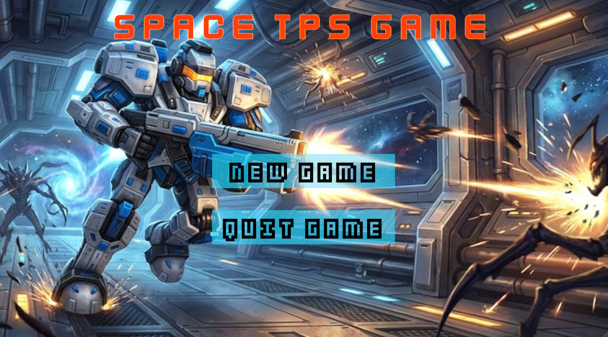

# TPS Project
## TPS Game

이 프로젝트는 `플밍 4기 10팀`의 공부를 목적으로 만든 게임이며
장르는 TPS 장르이고 핵심 플레이는 몰려오는 적을 섬멸하는 뱀서라이크 게임 입니다.
플레이어는 몰려오는 적을 죽이고 나오는 동전을 먹어서 상점에서 능력치를 올리고 마지막엔 보스를 잡으면
게임이 클리어 됩니다.

- 장르 : TPS 뱀서류

- 플레이타임 : 30 ~ 40분

- 개발 환경 : Unity 2022.3.62 f2

- 플랫폼: Windows

- 프로젝트 기간 : 6일

- 팀원
   - 고병희
   - 김유훈
   - 서정오
   - 송근형
   - 조진행

---

## 게임 특징

- 마우스를 이용하여 화면 전환, 마우스 왼쪽 클릭으로 적을 공격

- Shift 키를 누르면 달리기, Q 키를 누르면 몬스터 스캔 기능

- TPS 슈팅 게임 조작법의 뱀파이어 서바이벌 컨셉 입니다.

---

## 플레이 방법
- 이동: WASD

- 점프: Space
- 달리기 : Shift
- 공격: Mouse Left Click
- 몬스터 스캔: Q
- 일시정지 : Esc

---

## 실행 환경
- Unity: 2022.3.62f2
- 플랫폼: Windows
---

## 협업 관리
- 노션
